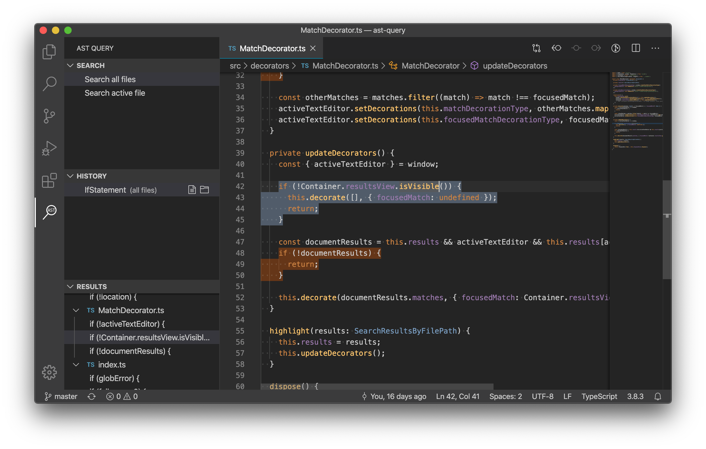

# ast-query README

Search and highlight JavaScript and TypeScript via Abstract Syntax Tree queries.

Uses [esquery](https://github.com/estools/esquery) and [typescript-estree](https://github.com/typescript-eslint/typescript-eslint/tree/master/packages/typescript-estree).

## Preview

## Extension Settings

This extension contributes the following settings:

| | type | default | description |
|---|---|---|---|
| `ast-query.globalFileGlob` | string | **/*.{js,ts} | include glob used when searching all files |
| `ast-query.globalIgnoreGlob` | string | \*\*/node_modules/\*\* | exclude glob used when searching all files |
| `ast-query.useGitignore` | boolean | true | Exclude files specified in gitignore when searching all files |

## TODO

* Add ability to toggle active/global search when invoked via command palette
* Remember actual searched file in search history, rather than just scope
* Disable search active file buttons in files with wrong file type
